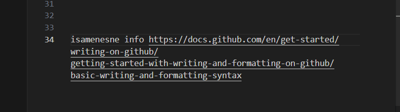

# Markdown
## Markdown
### Markdown
#### Markdown
Failo pletinys: .md

## Sarasas

daiktai:
-   pomidoras
    -   kebabas
-   agurkas
    - zalias
-   bulve

## Bold ir Italic

**Labas**  _rytas_ , _**Lietuva**_ !

**Labas** rytas 

## Nuorodos

Github: [mano profili](https://github.com/Klaikas-code
)

## Nuotruakos

isamenesne info https://docs.github.com/en/get-started/writing-on-github/getting-started-with-writing-and-formatting-on-github/basic-writing-and-formatting-syntax